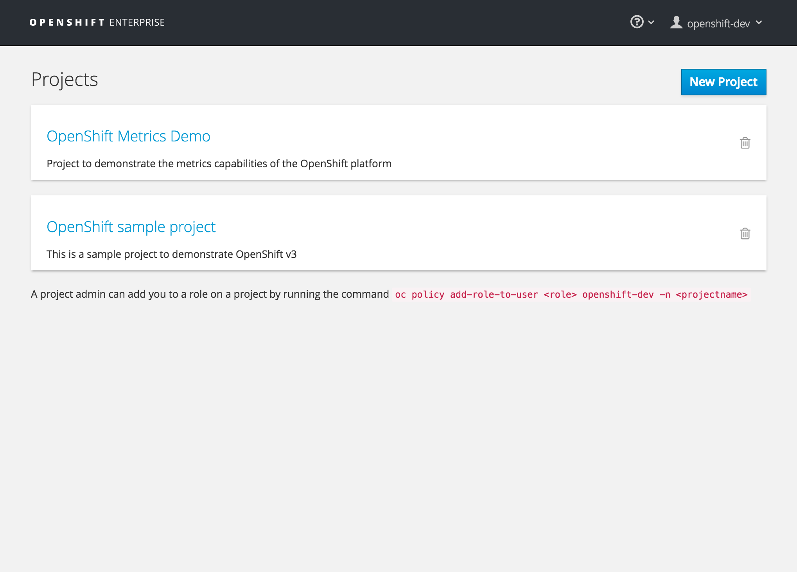
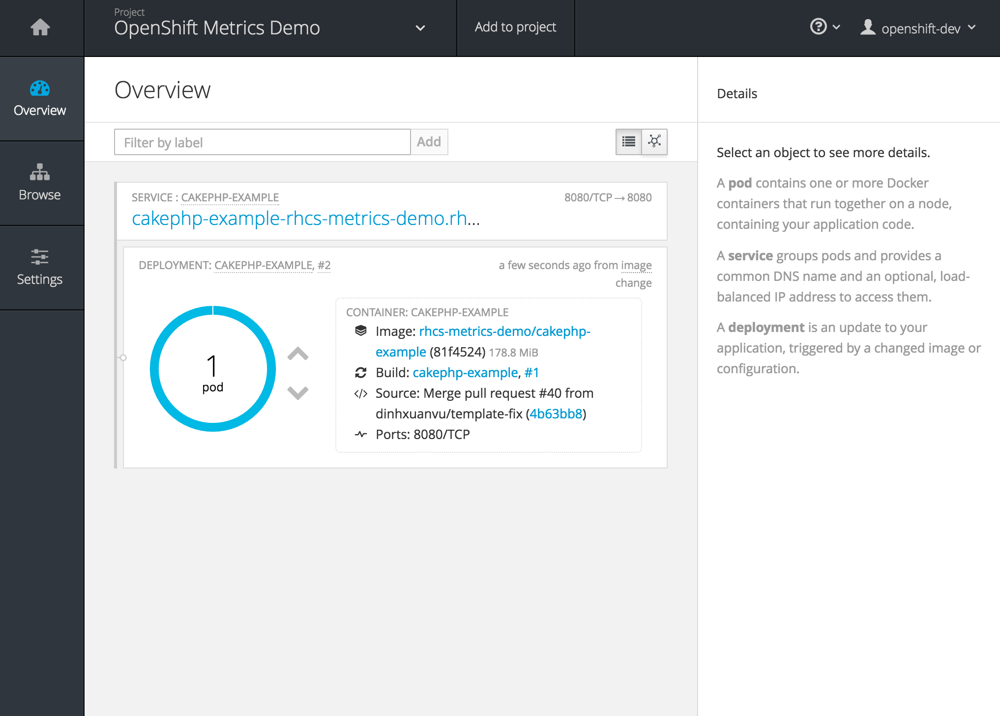
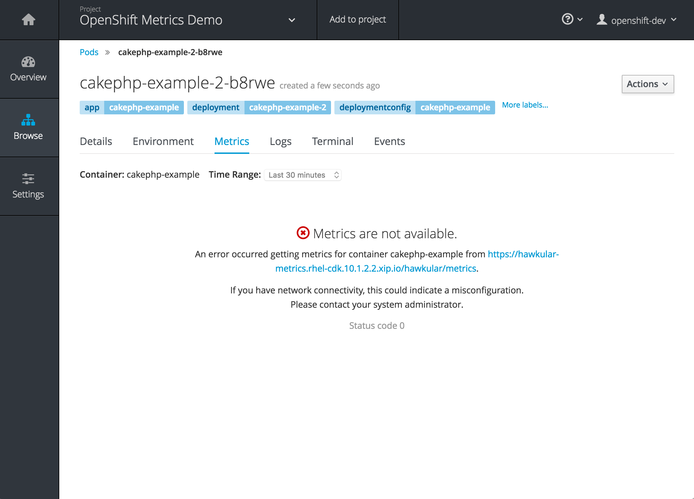
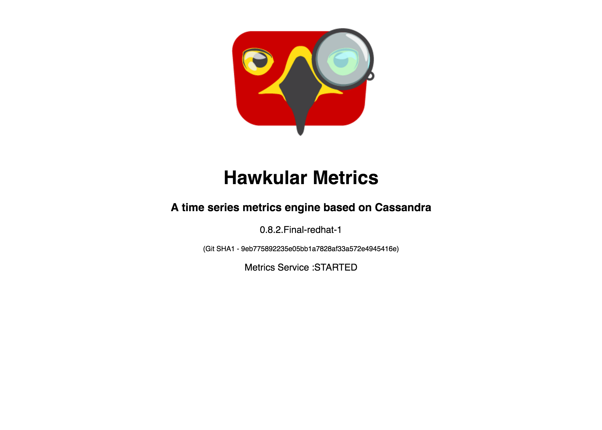
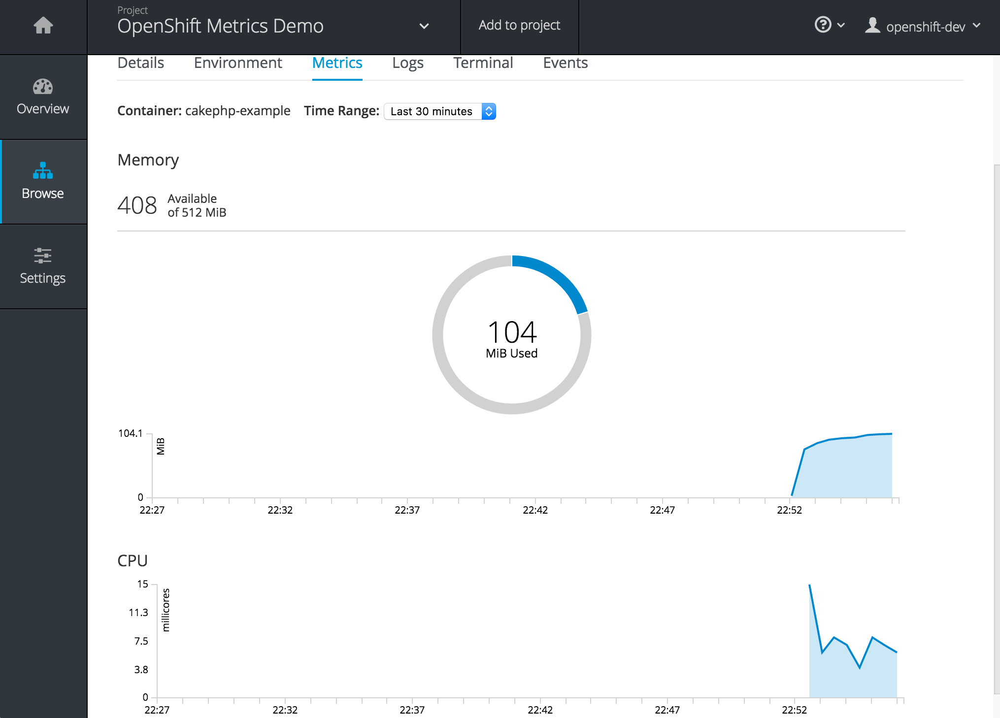

Metrics
=====================================
This demonstrates the capabilities provided by the integrated metrics functionality included in the OpenShift Container Platform (OCP) running in the Red Hat 
Container Development Kit (CDK).

Usage statistics from running applications can be accessed from a dashboard in the OpenShift Container Platform web console for insight into the environment. 


Install on Red Hat CDK OpenShift Container Platform image
-------------------------------------------------
1. First complete the installation steps supplied in the
	 [cdk-install-demo](https://github.com/redhatdemocentral/cdk-install-demo).

2. Install [OpenShift Client Tools](https://developers.openshift.com/managing-your-applications/client-tools.html) if you have not done so previously.

2. [Download and unzip this demo.](https://github.com/redhatdemocentral/rhcs-metrics-demo/archive/master.zip)

3. Run 'init.sh' or 'init.bat' file. 'init.bat' must be run with Administrative privileges.

4. Login to the OpenShift web console and accept the self signed certificate in the web browser :

    [https://10.1.2.2:8443:
    ( u:openshift-dev / p:level )
    
5. Select the **metrics-demo** project

6. On the left side of the page, select **Browse** and then **Pods**

7. Select the *running* pod (*cakephp-example-1-XXXXX*)

8. Select the **Metrics** tab

9. The integrated metrics also contains a self signed certificate that must be accepted prior to graphs properly displaying on the web page. Within the metrics tab, select the provided link and accept the self signed certificate. Return to the metrics tab to view the populated graphs. 

10. The running application can also be viewed at [http://cakephp-example-rhcs-metrics-demo.rhel-cdk.10.1.2.2.xip.io/](http://cakephp-example-rhcs-metrics-demo.rhel-cdk.10.1.2.2.xip.io/)


Notes
-----
Should your local network DNS not handle the resolution of the above address, giving you page not found errors, you can apply the
following to your local hosts file:

```
$ sudo vi /etc/hosts

# add host for CDK demo application resolution.
10.1.2.2   cakephp-example-rhcs-metrics-demo.rhel-cdk.10.1.2.2.xip.io hawkular-metrics.rhel-cdk.10.1.2.2.xip.io
```

# Metrics infrastructure provisioning

It can take time fully deploy and provision the metrics infrastructure. The status of the deployment can be confirmed by viewing the infrastructure components located within the `openshift-infra` project.

Since the `openshift-infra` project is a core infrastructure component, only cluster administrators can access these resources. The Red Hat CDK contains an administrator user called `admin` that can be used to access the base metrics components. 

Login to OpenShift using the `admin` user

```
oc login --password=admin ---user=admin 10.1.2.2
```

View the running containers in the `openshift-infra` project

```
oc get pods -n openshift-infra
NAME                         READY     STATUS      RESTARTS   AGE
hawkular-cassandra-1-4yst5   1/1       Running     0          56m
hawkular-metrics-8zulq       1/1       Running     0          56m
heapster-59ixe               1/1       Running     11         56m
metrics-deployer-zwq7j       0/1       Completed   0          1h
```

Confirm cassandra, heapster and hawkular pods all have a status of **Running** as shown above. Failures are expected until all resources have been fully deployed.


Supporting Articles
-------------------


Released versions
--------------------










